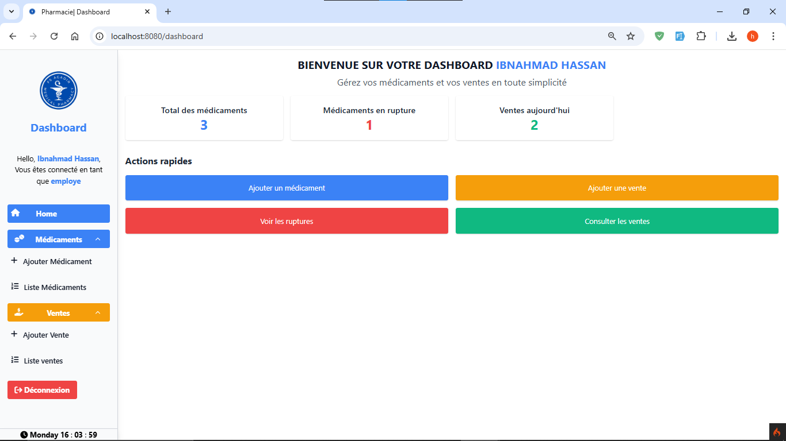
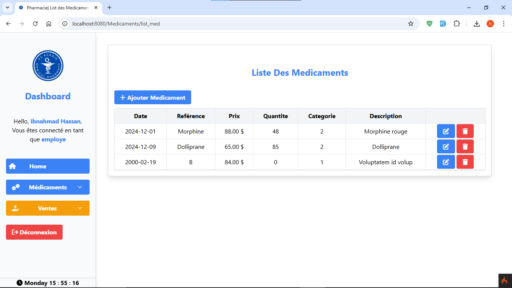
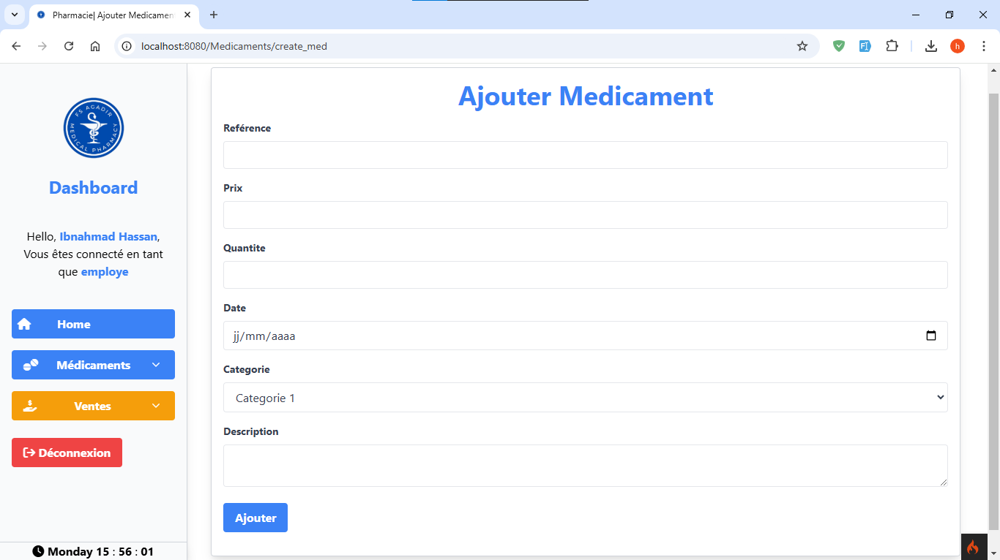
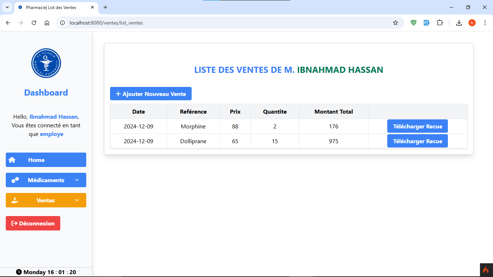
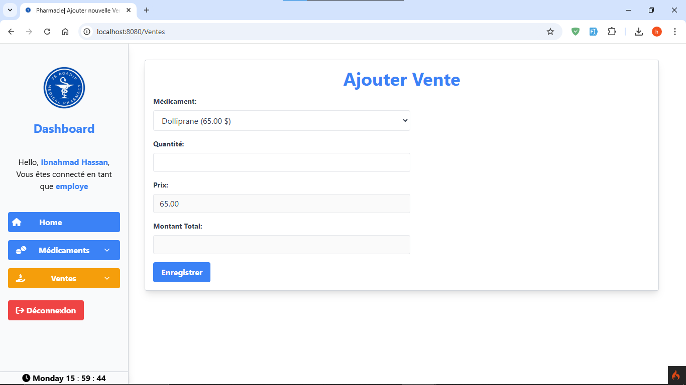
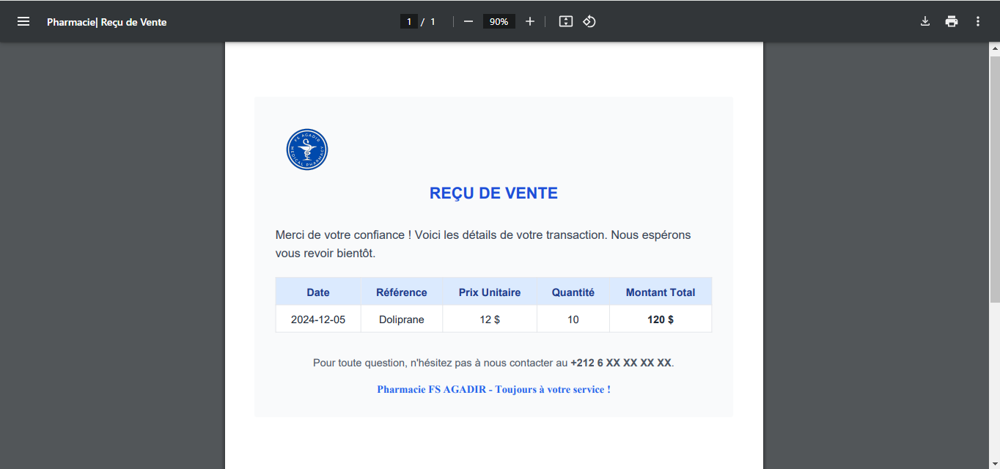

<!-- un fichier README.md pour présenter le projet gestion de pharmacie -->

# Gestion de pharmacie

## Description

Ce projet est une application de gestion de pharmacie qui permet de gérer les médicaments et les ventes des médicaments, il permet aussi de générer les recus des ventes.

## Fonctionnalités

- Ajouter un médicament
- Modifier un médicament
- Supprimer un médicament
- Afficher la liste des médicaments
- Ajouter une vente
- Afficher la liste des ventes
- Générer un reçu PDF

## Technologies utilisées

- codeigniter4
- tailwindcss
- mysql

## Installation

1. Cloner le projet

```bash
git clone
```

2. Installer les dépendances

```bash
composer install
```

3. Créer une base de données
4. Configurer le fichier .env
5. Exécuter les migrations

```bash
php spark migrate
```

6. Exécuter le serveur

```bash
php spark serve
```

7. Accéder à l'application

```
http://localhost:8080
```

## erreurs

tout les opreations de l'application sont sécurisées par des vérifications, si vous avez une erreur c'est surement parce que vous avez entré des données incorrectes ou vous avez essayé de faire une opération non autorisée.

## Comptes d'accès

- Clé d'enregistrement: `ABCD1234`

## Captures d'écran

- Page d'accueil
  
- Liste des médicaments
  
- Ajouter un médicament
  
- Liste des ventes
  
- Ajouter une vente
  
- Générer un reçu PDF
  

## Auteur

- [Hassan IBNAHMAD], étudiant en 3ème année du licence d'excellence en ingénierie logicielle à faculté des sciences de Agadir.
- [Mohamed OURKIYA], étudiant en 3ème année du licence d'excellence en ingénierie logicielle à faculté des sciences de Agadir.
